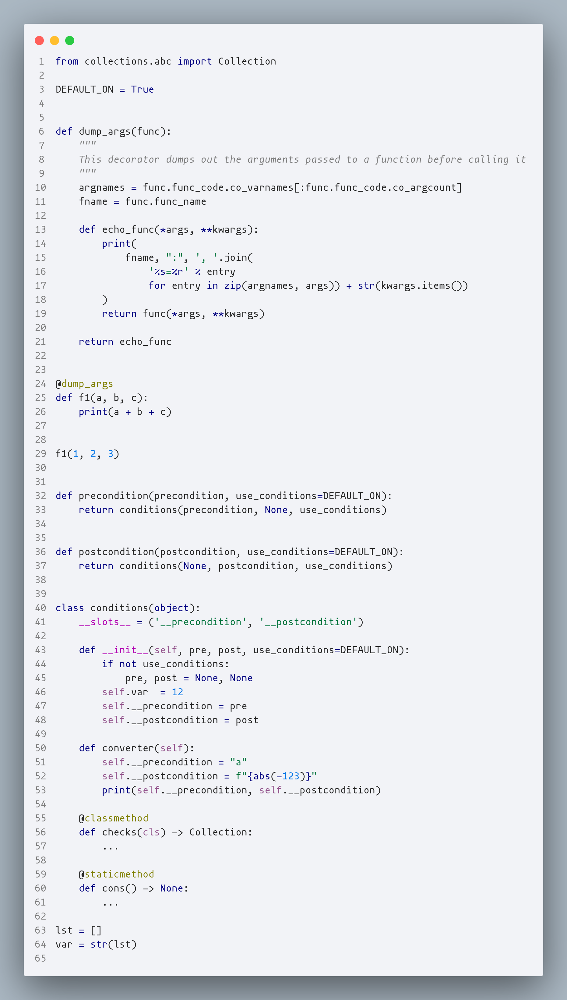

# What

This is a clone of the Cyan LIght Theme color scheme in JetBrains IDEs

# Why

Because the **currently** existing **forks are not supported**, they were created a couple of years ago, and the jetbrains theme is several, but is being updated + all the themes in vscode do not accurately recreate the color scheme (I assume this is due to differences in Python syntax highlighting)

# What I want to do

Try to create a theme as accurately as possible for at least python

# Required

Check that this setting has this value in `User Settings` (JSON) or in UI settings, without this the circuit will not work as accurately

```json
"editor.semanticHighlighting.enabled": "configuredByTheme"
```

# How it looks

#### Python



# P.S.

Thanks [OlyaB](https://github.com/OlyaB) for designing this wonderful theme

Thanks [cloud-66](https://github.com/cloud-66) for the initial fork, which I have already started from

